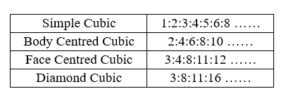
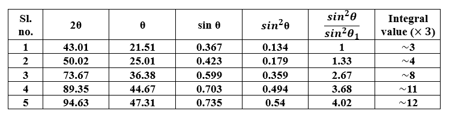

<!-- In the diffractogram given in <b>Figure 2</b> for an unknown material, the following procedure is adhered:   

<b>Steps :</b>  

1. Firstly, the 2θ values where diffraction occurred are obtained,   
2. Subsequently, the corresponding θ, sin θ and sin2θ values for all the peaks are noted,  
3. The ratios of sin2θ value of all the peaks with respect to the first peak is obtained,  
4. Finally, the obtained ratios are multiplied by a suitable integer to convert all these ratios into an integer.    -->

In the diffractogram given in <b>Figure 2</b> for an unknown material, the following procedure is adhered:  

<b>Step 1: Determination of diffraction peak positions</b> 
The 2θ values corresponding to the diffraction peaks are identified from the diffractogram. Each peak represents constructive interference from a specific set of crystal planes. 

<b>Step 2: Calculation of θ, sin θ, and sin2θ</b> 
The diffraction angle θ is obtained by dividing the measured 2θ value by two. The corresponding sin θ, and sin2θ values are then calculated. For cubic crystals, sin2θ is directly proportional to (h2+k2+l2), making it useful for peak indexing. 

<b>Step 3: Determination of normalized ratios</b> 
Each sin2θ value is divided by the smallest sin2θ value. This normalization removes the effect of lattice parameter and facilitates comparison with theoretical reflection sequences. 

<b>Step 4: Identification of integral sequence</b> 
The normalized ratios are multiplied by a suitable integer to obtain a sequence of whole numbers. These integers correspond to the allowed values of (h2+k2+l2), for a particular crystal structure. 

<b>Step 5: Peak indexing and crystal structure identification</b> 
The obtained integer sequence is compared with the theoretical reflection conditions of SC, BCC, FCC, and diamond cubic structures. The sequence 3:4:8:11:12 matches the allowed reflections of an FCC lattice, confirming that the unknown material possesses an FCC crystal structure. The corresponding Miller indices may then be assigned as (111), (200), (220), (311), and (222), respectively.

 

  

<b>It is clear from the above table that the unknown material whose diffractogram is given is an FCC material.</b>  

In addition to the ratio method, crystal structure determination can also be carried out using the analytical method. In this approach, the interplanar spacings calculated from Bragg's law are substituted into the structure-specific d-spacing equations. The diffraction peaks are indexed by assigning suitable Miller indices, and the lattice parameters are determined by solving the corresponding equations. For cubic systems, 1/d2 =((h2+k2+l2 ))/a2 , whereas for HCP systems, 1/d2 =4/3 ((h2+k2+l2)/a2 )+l2/c2 . This method provides a more rigorous determination of crystal structure and lattice parameters than the ratio method.

<!-- 5. The distinction between lattices of the cubic system is possible by using the fact that not all combinations of h2+k2+l2 lead to reflection for a given lattice. The ratio of h2+k2+l2 values for allowed reflections from different crystals are as follows [3]:   

<b>It is clear from the above table that the unknown material whose diffractogram is given is an FCC material.</b>  -->

