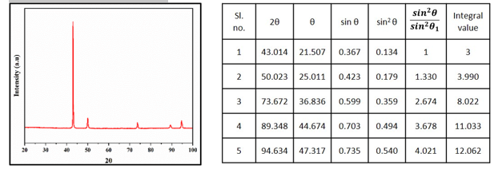
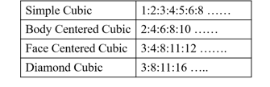

Crystal structure determination of an unknown powder using XRD is one among its many applications. For cubic crystals, interplanar spacing d, can be written as a function of the miller indices and lattice parameter a, using the following relation: 
   				d_((h k l))=  a/√(h^2+k^2+l^2 )					(1)
Combining the above equation with the Bragg’s law: nλ=2d sin⁡θ we obtain,		 (2) 
                                      (〖sin〗^2 θ)/((h^2+k^2+l^2 ) )=λ^2/〖4a〗^2 =const.					(3)
For 1st order diffraction, n=1 and monochromatic beam source λ and lattice parameter a of a material is constant, therefore the sum of the squares of the miller indices of a plane will be in proportion to the sin2θ values. In the diffractogram given below for an unknown material, we follow the procedure of obtaining 2θ values where diffraction occurred, then finding the corresponding θ, sin θ and sin2 θ values for all the peaks. The ratios of sin2 θ value of all the peaks with respect to the first peak is obtained and multiplied by a suitable integer to convert all these ratios into an integer. 
 
The distinction between lattices of the cubic system is possible by using the
fact that not all combinations of h2+k2+l2 lead to reflection for a given lattice. The ratio of h2+k2+l2 values for allowed reflections from different crystals are as follows: 
 
It is clear from the above table that the unknown material whose diffractogram is given, is an FCC material.
